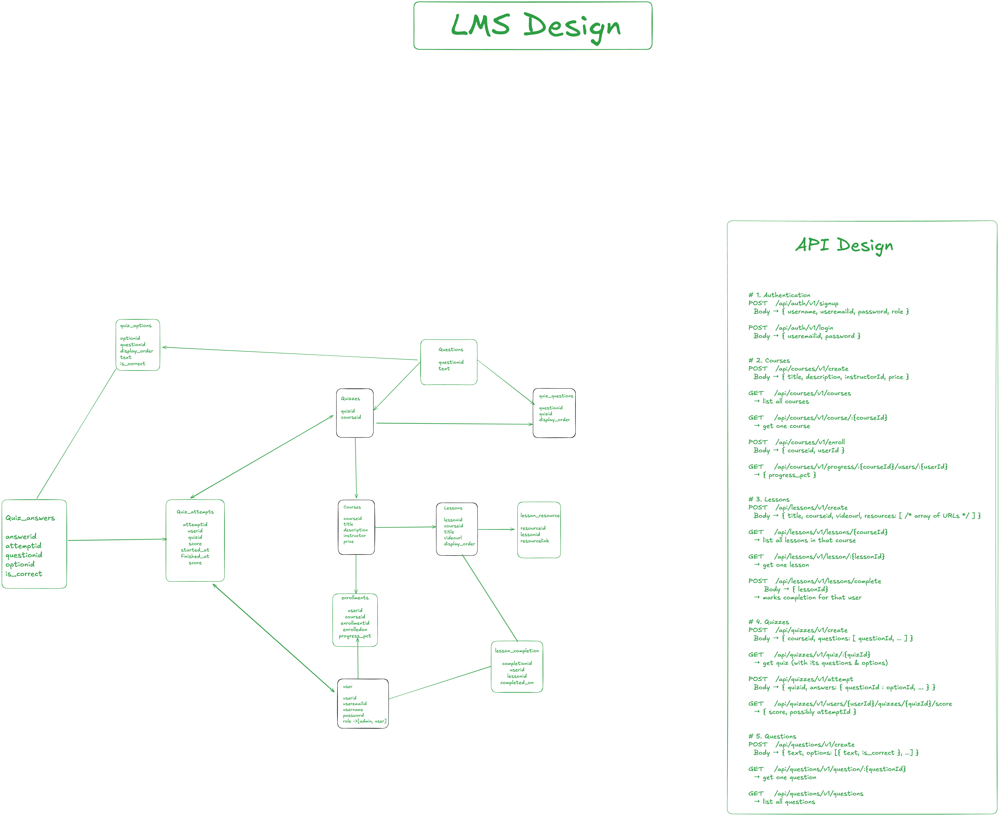

# 📚 Learning Management System (LMS) Backend

A simple backend for a Learning Management System built with **Node.js**, **Express**, and **PostgreSQL** (Prisma ORM).

---

## 🎯 Requirements

1. **User Authentication**: JWT-based signup/login; only authenticated users can enroll or track progress.
2. **Courses**:

   * Admin can create courses (title, description, instructor, price).
   * Users can view all courses, view course details (lessons & quizzes), and enroll.
3. **Lessons**:

   * Courses contain multiple lessons with a title, video URL, and optional resources.
4. **Quizzes**:

   * Courses include quizzes.
   * Each quiz has multiple questions with multiple-choice options (one correct answer).
   * Users can attempt quizzes and view scores per attempt.
5. **Progress Tracking**:

   * Users can mark lessons complete and see overall course progress (% completed).

---

## 🗂 Project Structure

```
LMS/
├── app/
│   ├── Controllers/          # Route handlers
│   ├── Services/             # Business logic
│   ├── db/
│   │   ├── prisma/           # Prisma schema, migrations, generated client
│   │   └── Repository/       # Data access layer (repositories)
│   ├── Middlewares/          # JWT auth, error handling, etc.
│   ├── Validators/           # Joi request schemas
│   └── Utils/                # Logger, Exceptions, helpers
├── routes/                   # Express routers
├── config/                   # Application configuration
├── app.js                    # Entry point (Express server)
├── lms.png                   # ER diagram & API design image (embedded below)
├── .env                      # Environment variables
├── package.json              # Dependencies & scripts
└── README.md                 # Project documentation
└── DB.md                     # DB Design explanation
```

---

## 📐 LMS Design (Inline Image)

To embed the design diagram directly in the README, place `lms.png` in the repo root and use:

```markdown

```


---

## 📡 API Endpoints & cURL Examples

### 1. Authentication

#### Sign Up

```bash
curl -X POST http://localhost:3000/api/auth/v1/signup \
  -H "Content-Type: application/json" \
  -d '{
    "username": "john",
    "useremailid": "john@example.com",
    "password": "Password123",
    "role": "user"
  }'
```

#### Login

```bash
curl -X POST http://localhost:3000/api/auth/v1/login \
  -H "Content-Type: application/json" \
  -d '{
    "useremailid": "john@example.com",
    "password": "Password123"
  }'
```

---

### 2. Courses (JWT required)

#### Create Course

```bash
curl -X POST http://localhost:3000/api/courses/v1/create \
  -H "Content-Type: application/json" \
  -H "Authorization: Bearer <JWT_TOKEN>" \
  -d '{
    "title": "Intro to JavaScript",
    "description": "Learn JS basics",
    "instructor": "Jane Doe",
    "price": 49.99
  }'
```

#### List All Courses

```bash
curl http://localhost:3000/api/courses/v1/courses \
  -H "Authorization: Bearer <JWT_TOKEN>"
```

#### Get Course by ID

```bash
curl http://localhost:3000/api/courses/v1/courses/COURSE_ID \
  -H "Authorization: Bearer <JWT_TOKEN>"
```

#### Enroll in Course

```bash
curl -X POST http://localhost:3000/api/courses/v1/enroll \
  -H "Content-Type: application/json" \
  -H "Authorization: Bearer <JWT_TOKEN>" \
  -d '{ "courseid": "COURSE_ID", "userid": "USER_ID" }'
```

#### Get Enrollment Progress

```bash
curl http://localhost:3000/api/courses/v1/progress/USER_ID/COURSE_ID \
  -H "Authorization: Bearer <JWT_TOKEN>"
```

---

### 3. Lessons

#### Create Lesson

```bash
curl -X POST http://localhost:3000/api/lessons/v1/create \
  -H "Content-Type: application/json" \
  -H "Authorization: Bearer <JWT_TOKEN>" \
  -d '{
    "courseid": "COURSE_ID",
    "title": "Lesson 1",
    "videourl": "https://...",
    "resources": ["https://...", "https://..."]
  }'
```

#### List Lessons in Course

```bash
curl http://localhost:3000/api/lessons/v1/lessons/COURSE_ID \
  -H "Authorization: Bearer <JWT_TOKEN>"
```

#### Get Lesson by ID

```bash
curl http://localhost:3000/api/lessons/v1/lesson/LESSON_ID \
  -H "Authorization: Bearer <JWT_TOKEN>"
```

#### Complete Lesson

```bash
curl -X POST http://localhost:3000/api/lessons/v1/complete \
  -H "Content-Type: application/json" \
  -H "Authorization: Bearer <JWT_TOKEN>" \
  -d '{ "lessonid": "LESSON_ID" }'
```

---

### 4. Quizzes

#### Create Quiz (link questions)

```bash
curl -X POST http://localhost:3000/api/quizzes/v1/create \
  -H "Content-Type: application/json" \
  -H "Authorization: Bearer <JWT_TOKEN>" \
  -d '{
    "courseid": "COURSE_ID",
    "questions": [
      { "questionid": "QUEST1_ID", "display_order": 1 },
      { "questionid": "QUEST2_ID", "display_order": 2 }
    ]
  }'
```

#### Get Quiz with Questions & Options

```bash
curl http://localhost:3000/api/quizzes/v1/QUIZ_ID \
  -H "Authorization: Bearer <JWT_TOKEN>"
```

#### Attempt Quiz

```bash
curl -X POST http://localhost:3000/api/quizzes/v1/attempt \
  -H "Content-Type: application/json" \
  -H "Authorization: Bearer <JWT_TOKEN>" \
  -d '{
    "quizid": "QUIZ_ID",
    "answers": [
      { "questionid": "Q1_ID", "optionid": "OPT1_ID" },
      { "questionid": "Q2_ID", "optionid": "OPT2_ID" }
    ]
  }'
```

#### Get Quiz Results

```bash
curl http://localhost:3000/api/quizzes/v1/results/QUIZ_ID \
  -H "Authorization: Bearer <JWT_TOKEN>"
```

---

### 5. Questions

#### Create Question

```bash
curl -X POST http://localhost:3000/api/questions/v1/create \
  -H "Content-Type: application/json" \
  -H "Authorization: Bearer <JWT_TOKEN>" \
  -d '{
    "text": "What is 2 + 2?",
    "options": [
      { "text": "3", "is_correct": false },
      { "text": "4", "is_correct": true }
    ]
  }'
```

#### Get Question by ID

```bash
curl http://localhost:3000/api/questions/v1/questions/QUESTION_ID \
  -H "Authorization: Bearer <JWT_TOKEN>"
```

#### List All Questions

```bash
curl http://localhost:3000/api/questions/v1/questions \
  -H "Authorization: Bearer <JWT_TOKEN>"
```
